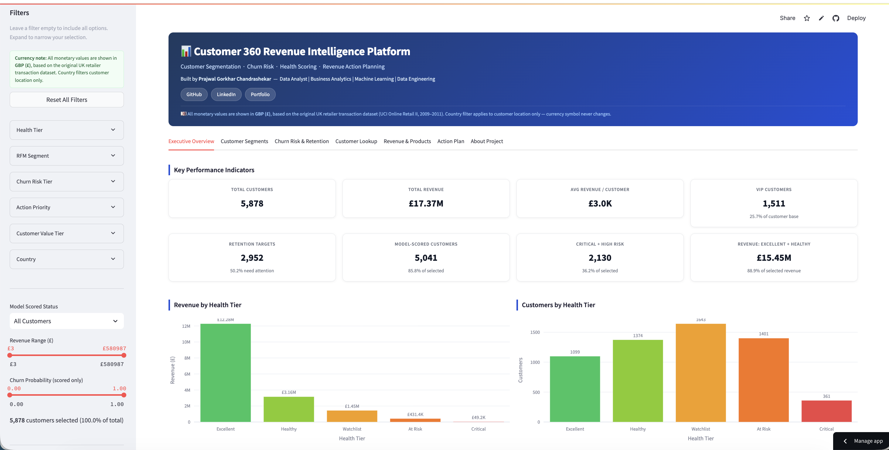
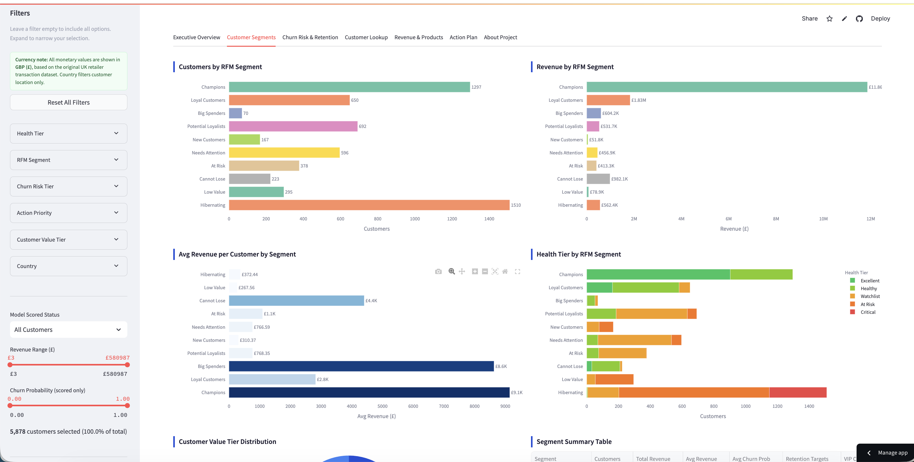
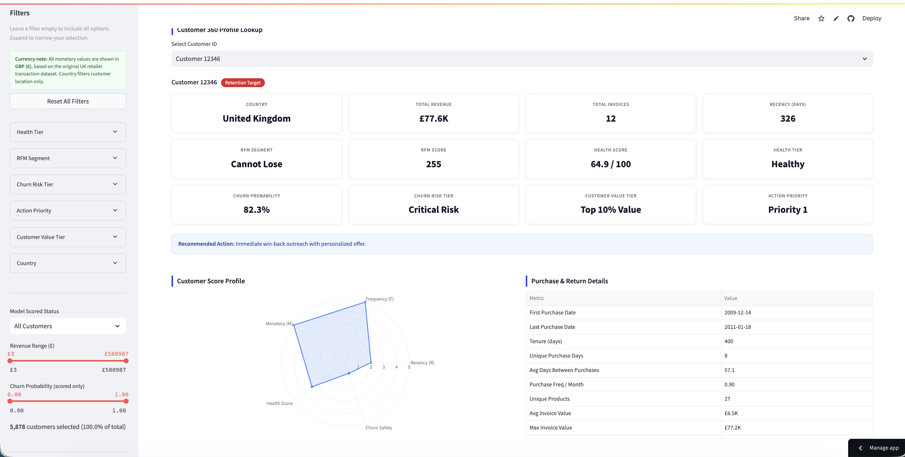
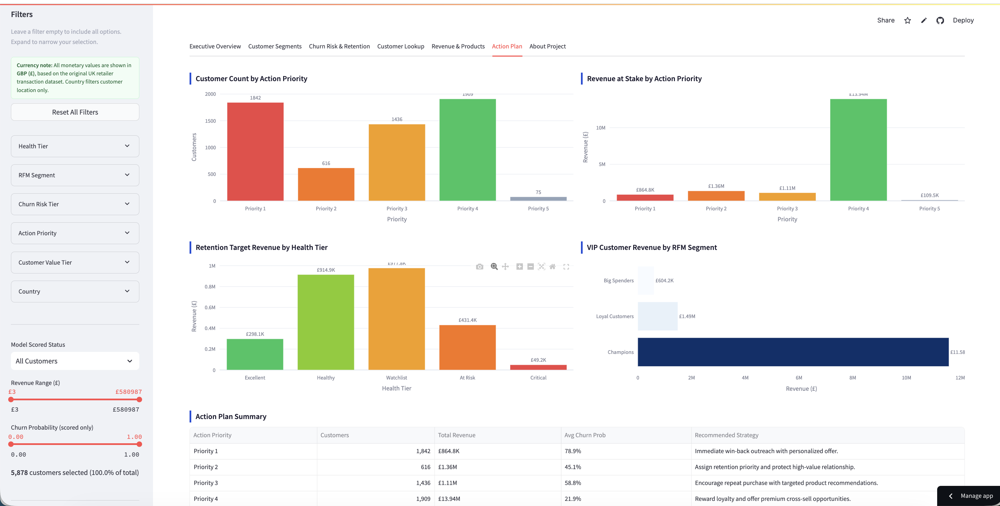
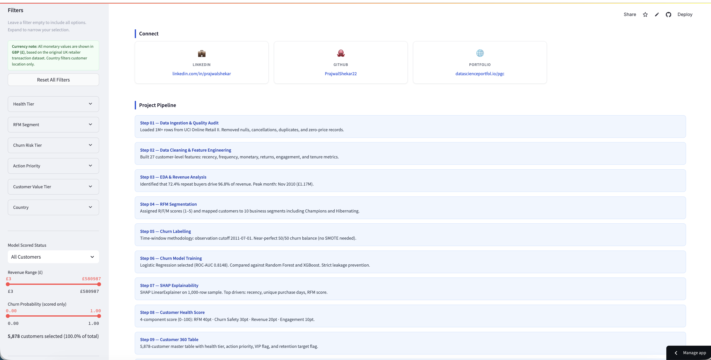

# Customer 360 Revenue Intelligence Platform

**Customer Segmentation · Churn Risk Prediction · Health Scoring · Revenue Action Planning**


---

## Live Demo

> Deployment pending. A Streamlit Community Cloud link will be added after GitHub publication.

To run the dashboard locally, see [How to Run Locally](#how-to-run-locally).

---

## Executive Summary

An end-to-end customer analytics platform that processes 1M+ online retail transactions, segments 5,878 customers using RFM scoring, predicts churn risk with a Logistic Regression model (ROC-AUC 0.8148), explains model drivers using SHAP, and delivers actionable retention and growth recommendations through a 7-tab interactive Streamlit dashboard.

**Core Business Problem:**
How can a business use customer transaction history to identify high-value customers, predict who is likely to churn, and prioritize retention and growth actions?

**Solution:**
A fully reproducible end-to-end Python pipeline that transforms raw Excel transaction data into cleaned transactions, 27-feature customer profiles, RFM segments, churn predictions, health scores, and business action priorities — all surfaced in an interactive dashboard.

**Key Insight:**
Champions represent 22.1% of customers but generate **68.3% of revenue (£11.86M)**. Meanwhile, 2,952 customers are flagged as retention targets and 874 are classified as Critical Risk.

---

## Key Results at a Glance

| Metric | Result |
|---|---|
| Raw transaction rows | 1,067,371 |
| Clean transaction rows | 779,425 |
| Customers analyzed | 5,878 |
| Total revenue | £17,374,804.27 |
| Repeat buyers | 4,255 customers (72.4%) |
| Revenue from repeat buyers | £16,814,532 (96.8% of total) |
| Champion customers | 1,297 (22.1% of customers) |
| Revenue from Champions | £11.86M (68.3% of total) |
| Churn model ROC-AUC | **0.8148** (Logistic Regression) |
| Observation window customers | 5,041 |
| Churned customers (label) | 2,512 (49.8%) |
| Retained customers (label) | 2,529 (50.2%) |
| Retention targets flagged | 2,952 customers |
| VIP customers | 1,511 customers |
| Dashboard tabs | 7 |

---

## Project Overview

This project uses the [UCI Online Retail II dataset](https://archive.ics.uci.edu/dataset/502/online+retail+ii) to build a Customer 360 analytics platform for a UK-based online retailer. The pipeline starts from raw Excel files and ends with an interactive Streamlit dashboard that allows users to explore customer segments, churn risk, revenue concentration, health tiers, and action priorities — all driven by real transaction data with no hardcoded metrics.

The project demonstrates practical skills in data analytics, business analytics, machine learning, model explainability, and business dashboarding.

---

## Business Problem

Retail businesses need answers to key questions that raw transaction data alone cannot provide:

- Who are our most valuable customers?
- Which customers are at risk of churning?
- Which customer groups generate the majority of revenue?
- Which customers should receive retention campaigns vs loyalty rewards vs growth nurture?
- How do we quantify customer health in a single, business-friendly metric?

This project addresses each question using a structured, reproducible customer analytics workflow built entirely from transaction history.

---

## Dataset

| Property | Value |
|---|---|
| Name | UCI Online Retail II |
| Source | UC Irvine Machine Learning Repository |
| Raw rows | 1,067,371 |
| Sheets | Year 2009-2010, Year 2010-2011 |
| Date range | December 2009 – December 2011 |
| Retailer | UK-based online gift/retail store |
| Columns | Invoice, StockCode, Description, Quantity, InvoiceDate, Price, Customer ID, Country |

**Currency note:** All monetary values are treated as GBP (£), consistent with the UK-based retailer source. Country filters customer location only and does not change transaction currency.

**Important limitations of this dataset:**
- Does not contain a true churn label — churn was engineered using a time-window method
- Does not contain customer demographics
- Does not include marketing campaign or contact history data
- Does not include exchange rates or multi-currency pricing

---

## Tech Stack

| Category | Tools | Version | Purpose |
|---|---|---|---|
| Language | Python | 3.11 | All pipeline scripts |
| Data Processing | pandas, NumPy | 2.2.2, 1.26.4 | Cleaning, EDA, feature engineering |
| Storage Format | Parquet (pyarrow), CSV | — | Processed datasets for efficient I/O |
| Machine Learning | scikit-learn, XGBoost | 1.4.2, 2.0.3 | Churn model training and comparison |
| Explainability | SHAP | 0.45.1 | Model driver interpretation |
| Visualization | Plotly, matplotlib | 5.22, 3.8.4 | Interactive and static charts |
| Dashboard | Streamlit | 1.35.0 | Interactive Customer 360 dashboard |
| Version Control | Git | — | Local commits and project history |

**Future / optional extensions (not yet implemented):**
BigQuery · Looker Studio · Docker · GitHub Actions · Streamlit Community Cloud

---

## Project Architecture

```
Raw Excel Data (online_retail_II.xlsx)
          ↓
   Data Inspection                  →  reports/data_inspection.txt
          ↓
  Data Quality Audit                →  reports/data_quality_summary.csv
          ↓
     Data Cleaning                  →  clean_transactions.parquet
          ↓
   Clean Output Verification        →  22-point assertion checks
          ↓
 Exploratory Data Analysis          →  7 CSV tables + 6 Plotly HTML charts
          ↓
Customer Feature Engineering        →  customer_features.parquet (5,878 × 27)
          ↓
     RFM Segmentation               →  rfm_segments.parquet (10 segments)
          ↓
   Churn Label Creation             →  churn_model_base.parquet (5,041 labeled)
          ↓
  Churn Model Training              →  churn_model.pkl (LR, RF, XGBoost compared)
          ↓
   SHAP Explainability              →  SHAP plots + feature importance CSV
          ↓
  Customer Health Score             →  customer_360.parquet (5,878 × 46)
          ↓
  Streamlit Dashboard               →  app/streamlit_app.py (7 tabs)
```

All processed outputs are stored as Parquet and CSV files for reproducible, fast local analytics and efficient dashboard loading.

---

## Folder Structure

```
customer-360-revenue-intelligence/
├── app/
│   └── streamlit_app.py              # 7-tab Streamlit dashboard
├── data/
│   ├── raw/                          # Source Excel file (gitignored)
│   ├── interim/                      # Intermediate outputs
│   └── processed/                    # Final cleaned datasets (gitignored)
├── models/
│   ├── churn_model.pkl               # Trained LR pipeline (gitignored)
│   ├── churn_feature_columns.json    # Feature metadata
│   └── model_metrics.json            # Performance metrics for all models
├── notebooks/                        # Jupyter notebooks (exploratory)
├── reports/
│   ├── figures/                      # Plotly HTML + SHAP PNG charts
│   └── screenshots/                  # Dashboard screenshots (for README)
├── sql/                              # SQL reference queries
├── src/
│   ├── 01_load_and_inspect.py
│   ├── 02_data_quality_audit.py
│   ├── 03_clean_data.py
│   ├── 04_verify_clean_outputs.py
│   ├── 05_eda.py
│   ├── 06_build_customer_features.py
│   ├── 07_rfm_segmentation.py
│   ├── 08_churn_labeling.py
│   ├── 09_train_churn_model.py
│   ├── 10_shap_explainability.py
│   └── 11_customer_health_score.py
├── README.md
├── requirements.txt
└── environment.yml
```

---

## Pipeline Steps

| Step | Script | Main Output | Purpose |
|---|---|---|---|
| 01 | `01_load_and_inspect.py` | `data_inspection.txt` | Load both Excel sheets, print schema |
| 02 | `02_data_quality_audit.py` | `data_quality_summary.csv` | Audit nulls, duplicates, anomalies |
| 03 | `03_clean_data.py` | `clean_transactions.parquet` | Remove nulls, cancellations, bad rows |
| 04 | `04_verify_clean_outputs.py` | Console (22 assertions) | Validate cleaning correctness |
| 05 | `05_eda.py` | 6 HTML charts, 7 CSVs | Revenue trends, customer behavior |
| 06 | `06_build_customer_features.py` | `customer_features.parquet` | 27 customer-level features |
| 07 | `07_rfm_segmentation.py` | `rfm_segments.parquet` | RFM scores + 10 business segments |
| 08 | `08_churn_labeling.py` | `churn_model_base.parquet` | Time-window churn labels, leakage check |
| 09 | `09_train_churn_model.py` | `churn_model.pkl`, metrics | LR / RF / XGBoost training, risk tiers |
| 10 | `10_shap_explainability.py` | SHAP plots, importance CSV | Model driver interpretation |
| 11 | `11_customer_health_score.py` | `customer_360.parquet` | Health score + action priorities |
| 12 | `app/streamlit_app.py` | Dashboard at port 8501 | Interactive Customer 360 dashboard |

---

## Data Cleaning Summary

| Step | Count |
|---|---|
| Raw transaction rows | 1,067,371 |
| Duplicate rows removed | 34,335 |
| Null Customer ID rows dropped | 234,437 |
| Returns/cancellations separated | 19,104 rows → `returns.csv` |
| Invalid price rows dropped | 70 |
| **Final clean transactions** | **779,425** |

**Notes:**
- Rows without a Customer ID were removed from customer-level analytics as they cannot be attributed to an individual customer.
- Returns and cancellations (Invoice prefix `C`) were separated into a dedicated `returns.csv` for potential future analysis.
- Only transactions with positive quantity and positive unit price were retained for purchase analytics.

---

## EDA Findings

| Metric | Value |
|---|---|
| Clean transaction rows | 779,425 |
| Unique customers | 5,878 |
| Unique invoices | 36,969 |
| Unique products | 4,631 |
| Unique countries | 41 |
| Total revenue | £17,374,804.27 |
| Total quantity sold | 10,513,952 units |
| Average order value | £469.98 |
| Median order value | £303.04 |
| Peak revenue month | Nov 2010 — £1,166,460 |
| Lowest revenue month | Feb 2011 — £446,085 |
| Peak active customers | 1,664 (Nov 2011) |
| Repeat buyers | 4,255 customers (72.4%) |
| Revenue from repeat buyers | £16,814,532 (96.8% of total) |
| Top customer by revenue | Customer 18102 — £580,987 |
| Top country by revenue | United Kingdom — £14,389,235 (82.8%) |
| Top product by revenue | REGENCY CAKESTAND 3 TIER — £277,656 |

---

## Customer Feature Engineering

27 features were built per customer from the full transaction history:

| Category | Features |
|---|---|
| Identity | `customer_id`, `country_mode` |
| Timeline | `first_purchase_date`, `last_purchase_date`, `customer_tenure_days`, `recency_days` |
| Frequency | `total_invoices`, `unique_purchase_days`, `avg_days_between_purchases`, `purchase_frequency_per_month` |
| Monetary | `total_revenue`, `average_invoice_value`, `max_invoice_value`, `min_invoice_value` |
| Basket | `total_line_items`, `total_quantity`, `unique_products`, `quantity_per_invoice`, `products_per_invoice` |
| Unit value | `average_line_revenue`, `average_unit_price` |
| Returns | `total_returns`, `return_quantity_abs`, `has_returned`, `return_rate` |
| Loyalty | `is_repeat_buyer` |

**Output validation:**
- Final table: 5,878 customers × 27 features
- Revenue reconciliation: £17,374,804.27 — **£0.00 difference** vs raw transaction sum
- Repeat buyers: 4,255 (72.4%) · Customers with returns: 2,511 (42.7%)
- Mean recency: 201.3 days · Median recency: 96 days

---

## RFM Segmentation

RFM scores (1–5) were assigned per dimension using quantile-based bins with a rank-percentile fallback for tied values (common in frequency distributions with many single-invoice customers). Recency uses an inverted scale: lower days = higher score.

| Segment | Customers | % | Revenue | Rev % | Meaning |
|---|---|---|---|---|---|
| Champions | 1,297 | 22.1% | £11.86M | 68.3% | High R, F, M — best customers |
| Loyal Customers | 650 | 11.1% | £1.83M | 10.6% | Frequent, consistently high value |
| Potential Loyalists | 692 | 11.8% | £532K | 3.1% | Recent buyers with growth potential |
| Needs Attention | 596 | 10.1% | £457K | 2.6% | Above average, need re-engagement |
| Hibernating | 1,510 | 25.7% | £562K | 3.2% | Inactive — low recency and frequency |
| At Risk | 378 | 6.4% | £413K | 2.4% | Previously good, now going cold |
| Cannot Lose | 223 | 3.8% | £982K | 5.7% | High historical value, now inactive |
| Big Spenders | 70 | 1.2% | £604K | 3.5% | High monetary, lower frequency |
| New Customers | 167 | 2.8% | £52K | 0.3% | Recent first-time buyers |
| Low Value | 295 | 5.0% | £79K | 0.5% | Low spend across all dimensions |

> Champions are 22.1% of customers but generate **68.3% of revenue** — the dominant segment by revenue concentration.

---

## Churn Labeling Methodology

The original dataset does not include a churn label. Churn was engineered using a time-window methodology:

| Window | Date Range |
|---|---|
| Observation window | December 2009 – June 2011 |
| Prediction window | July 2011 – December 2011 |

**Label rules:**
- `churned = 1` — customer purchased during the observation window but **not** during the prediction window
- `churned = 0` — customer purchased during **both** windows
- Customers appearing only in the prediction window were excluded from model training

| Metric | Value |
|---|---|
| Observation window transactions | 557,398 rows |
| Prediction window transactions | 222,027 rows |
| Observation window customers | 5,041 |
| Prediction-only customers excluded | 837 |
| Churned (label = 1) | 2,512 (49.8%) |
| Retained (label = 0) | 2,529 (50.2%) |

**Leakage prevention:** All model features were calculated exclusively from observation-window transactions and prefixed `obs_`. Full-period RFM segments and customer features were never used as training inputs.

---

## Churn Model Training

Three models were trained and compared on an 80/20 stratified train-test split:

| Model | Accuracy | Precision | Recall | F1 | ROC-AUC | Avg Precision |
|---|---|---|---|---|---|---|
| **Logistic Regression** | 0.7265 | 0.7179 | 0.7435 | 0.7305 | **0.8148** | **0.8004** |
| Random Forest | 0.7294 | 0.7076 | 0.7793 | 0.7417 | 0.8114 | 0.7887 |
| XGBoost | 0.7215 | 0.7063 | 0.7555 | 0.7301 | 0.7978 | 0.7625 |

**Selected model: Logistic Regression**

Logistic Regression achieved the highest ROC-AUC (0.8148) and Average Precision (0.8004). It was selected because it matches Random Forest performance closely while remaining fully interpretable — coefficients map directly to business-readable churn drivers.

---

## Churn Risk Tiers

| Risk Tier | Churn Probability | Customers | % | Recommended Action |
|---|---|---|---|---|
| Critical Risk | ≥ 80% | 874 | 17.3% | Immediate personal outreach + offer |
| High Risk | 60–79% | 1,256 | 24.9% | Targeted win-back email within 7 days |
| Medium Risk | 40–59% | 1,387 | 27.5% | Monitor and nurture |
| Low Risk | < 40% | 1,524 | 30.2% | Loyalty and cross-sell campaigns |

837 customers who entered during the prediction window are labeled **Not Scored** and retained in the Customer 360 table with a neutral health component.

---

## SHAP Explainability

`shap.LinearExplainer` was applied to the Logistic Regression model on a 1,000-row background sample.

**Outputs generated:**
- `reports/figures/churn_shap_beeswarm.png`
- `reports/figures/churn_shap_bar.png`
- `reports/churn_global_feature_importance.csv` — 57 transformed features ranked by |coefficient|
- `reports/churn_customer_explanations_sample.csv` — top-20 high-risk customers with SHAP top-3 drivers

**Business interpretation (associative, not causal):**

| Direction | Feature | Interpretation |
|---|---|---|
| ↑ Churn risk | `obs_recency_days` | Longer inactivity associated with higher churn |
| ↑ Churn risk | `obs_average_unit_price` | Higher avg unit price at transaction time |
| ↓ Churn risk | `obs_unique_purchase_days` | More purchase days strongly associated with retention |
| ↓ Churn risk | `obs_m_score` | Higher monetary RFM score reduces churn risk |
| ↓ Churn risk | `obs_rfm_total_score` | Stronger RFM profile reduces churn risk |

> Country one-hot encoded features produce some of the largest model coefficients. These are associative — they likely reflect customer mix or regional patterns and should **not** be interpreted as causal effects of geography on churn.

---

## Customer Health Score

The Customer 360 table merges all upstream outputs into one customer-level record with a composite health score:

**Health score formula (0–100 points):**

| Component | Max Points | Basis |
|---|---|---|
| RFM | 40 | `(rfm_total_score / 15) × 40` |
| Churn safety | 30 | `(1 − churn_probability) × 30` · neutral 15 for Not Scored |
| Revenue | 20 | Revenue percentile rank × 20 |
| Engagement | 10 | `(is_repeat_buyer × 0.5 + freq_percentile × 0.5) × 10` |

**Health tier distribution:**

| Tier | Score | Customers | % |
|---|---|---|---|
| Excellent | ≥ 80 | 1,099 | 18.7% |
| Healthy | 60–79 | 1,374 | 23.4% |
| Watchlist | 40–59 | 1,643 | 28.0% |
| At Risk | 20–39 | 1,401 | 23.8% |
| Critical | < 20 | 361 | 6.1% |

> Excellent + Healthy customers hold **88.9% of revenue (£15.4M)** while representing 42.1% of customers.

**Action priority distribution:**

| Priority | Customers | Revenue at Stake | Strategy |
|---|---|---|---|
| Priority 1 — Urgent Retention | 1,842 | £864K | Immediate win-back outreach |
| Priority 2 — High Value Save | 616 | £1.36M | Protect high-value relationships |
| Priority 3 — Growth Opportunity | 1,436 | £1.11M | Drive repeat purchase |
| Priority 4 — Loyalty / Upsell | 1,909 | £13.94M | Reward and expand |
| Priority 5 — Low Cost Nurture | 75 | £109K | Automated drip |

**Key flags:** Retention targets: **2,952** · VIP customers: **1,511**
**Final table:** 5,878 customers × 46 columns · Revenue reconciliation: £0.00 difference

---

## Streamlit Dashboard

**File:** `app/streamlit_app.py`

```bash
streamlit run app/streamlit_app.py
```

| Tab | Purpose |
|---|---|
| Executive Overview | KPI cards, revenue/health/churn/priority charts, auto-generated insights |
| Customer Segments | RFM analysis, value tier distribution, segment summary table |
| Churn Risk & Retention | Probability histogram, risk charts, scatter plot, top-20 risk table |
| Customer Lookup | Per-customer 360 profile, radar chart, purchase detail table |
| Revenue & Products | Monthly trend, AOV, top-10 countries, top-10 products |
| Action Plan | Priority charts, retention/VIP revenue, action table, CSV downloads |
| About Project | Pipeline summary, connect links, dataset notes, disclaimer |

**Features:** 8 sidebar filters · Live KPI cards · 20+ Plotly charts · 4 CSV exports · Customer radar chart · Not Scored handling · GBP (£) currency throughout

---

## Dashboard Screenshots

Screenshots will be added before deployment.








---

## How to Run Locally

### 1. Clone the repository
```bash
git clone https://github.com/PrajwalShekar22/customer-360-revenue-intelligence.git
cd customer-360-revenue-intelligence
```

### 2. Create the conda environment
```bash
conda env create -f environment.yml
conda activate customer360
```

Alternative (pip only):
```bash
pip install -r requirements.txt
```

### 3. Add the dataset
Download the UCI Online Retail II dataset:
https://archive.ics.uci.edu/dataset/502/online+retail+ii

Place the file at:
```
data/raw/online_retail_II.xlsx
```

### 4. Run the pipeline in order
```bash
python src/01_load_and_inspect.py
python src/02_data_quality_audit.py
python src/03_clean_data.py
python src/04_verify_clean_outputs.py
python src/05_eda.py
python src/06_build_customer_features.py
python src/07_rfm_segmentation.py
python src/08_churn_labeling.py
python src/09_train_churn_model.py
python src/10_shap_explainability.py
python src/11_customer_health_score.py
```

### 5. Launch the dashboard
```bash
streamlit run app/streamlit_app.py
```

Opens at `http://localhost:8501`.

---

## Business Recommendations

1. **Protect Champions and Loyal Customers** — These segments generate 78.9% of revenue. Reward with loyalty programs, early access, and premium upsell offers.
2. **Urgent outreach for Critical Risk customers** — 874 customers have ≥ 80% predicted churn probability. Personal outreach within 48 hours.
3. **Win-back High Risk customers** — 1,256 customers at 60–79% probability. Targeted email within 7 days.
4. **Protect Cannot Lose accounts** — High historical revenue, now inactive. Dedicated account management touch.
5. **Incentivize second purchase from one-time buyers** — One-time buyers churn at 75.5%. A timely second-purchase incentive can convert them to repeat buyers.
6. **Automate nurture for Hibernating and Low Value segments** — Avoid expensive human touch; use automated email with monitoring.
7. **Monitor Not Scored customers** — 837 customers lack sufficient history for churn scoring. Assign risk tiers once purchase history accumulates.

---

## Limitations

- **Historical data:** Dataset covers December 2009 – December 2011. Any insights or models must be recalibrated on current data before operational use.
- **Engineered churn label:** The dataset does not include a true churn label. Churn is defined as purchase inactivity during the prediction window — seasonal patterns could produce false positives.
- **Currency assumption:** All monetary values are assumed GBP (£) based on the UK retailer context. No exchange rate data is available.
- **No demographics:** Customer age, gender, or segment identifiers beyond country are not in the dataset.
- **No campaign data:** Customer behavior cannot be attributed to specific marketing campaigns.
- **Country coefficients:** One-hot country features show large LR coefficients. These are associative and reflect customer mix — not causal effects of geography on churn.
- **Portfolio scope:** This is a portfolio and educational project, not a production business system. It is not connected to live data, real customers, or production infrastructure.

---

## Future Improvements

| Improvement | Description |
|---|---|
| Streamlit Cloud deployment | Publish dashboard with a public URL |
| BigQuery warehouse | Move processed data to BigQuery for scalable SQL analytics |
| Looker Studio dashboard | Executive-facing report on top of BigQuery |
| Docker containerisation | Package pipeline and dashboard as a portable Docker image |
| GitHub Actions CI | Automate data validation and pipeline checks on every push |
| Model monitoring | Add drift detection and retraining triggers |
| Live data refresh | Replace static Parquet files with scheduled pipeline runs |
| Extended features | Add product categories, seasonality, and campaign response signals |

---

## Author

**Prajwal Gorkhar Chandrashekar**
Data Analyst | Business Analytics | Machine Learning | Data Engineering

| Platform | Link |
|---|---|
| GitHub | [github.com/PrajwalShekar22](https://github.com/PrajwalShekar22) |
| LinkedIn | [linkedin.com/in/prajwalshekar](https://www.linkedin.com/in/prajwalshekar) |
| Portfolio | [datascienceportfol.io/pgc](https://www.datascienceportfol.io/pgc) |

---

*© 2026 Prajwal Gorkhar Chandrashekar. Portfolio project for demonstration purposes. Insights are based on the UCI Online Retail II public historical dataset.*
